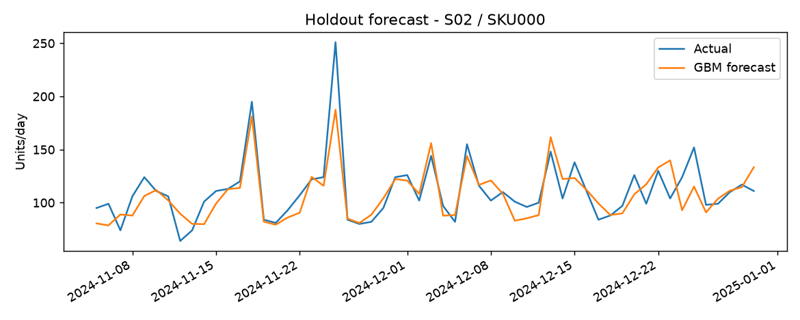
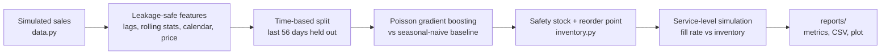

<div align="center">

# 🛒 Retail Demand Forecasting & Inventory Optimization

**Forecast demand. Cut inventory. Keep shelves full.**

[](https://github.com/manojdasb/retail-demand-inventory-optimizer/actions)


</div>

An end-to-end, tested pipeline that **forecasts daily store × SKU demand** and turns the forecast into an **inventory policy** (safety stock, reorder point, order-up-to), then measures the business impact with a service-level simulation.

The idea behind it: *a more accurate forecast lets you hold less stock for the same in-stock rate.*

---

## 💡 In plain English

**The problem.** A store has to decide how many units of each product to stock. Order too little and shelves run empty (lost sales). Order too much and money is stuck in unsold goods (extra cost).

**What this project does.**
1. **Predicts** how many units of each product each store will sell tomorrow, using past sales, the day of the week, holidays and promotions.
2. **Decides how much stock to hold**, adding a safety buffer sized to how wrong the predictions tend to be.
3. **Tests the decision** in a simulation: it replays 8 weeks of sales the model never saw and checks how often the shelf was empty and how much stock was sitting around.

**What the results mean.** The model's predictions are about **37% more accurate** than a simple "same as last week" guess. Because it is more accurate, the store needs a smaller safety buffer, so it holds **about 17% less stock** and still has the product available almost every day.

### Quick glossary

| Term | Meaning |
|---|---|
| **SKU** | One specific product (e.g. one size of one shampoo) |
| **WAPE** | Forecast error as a percentage of total sales. Lower is better |
| **Baseline** | A simple guess to beat. Here: "same weekday last week" |
| **Safety stock** | Extra units kept to cover unexpectedly high demand |
| **Fill rate** | Share of customer demand that was actually available |
| **Leakage** | Accidentally letting the model see the future, which makes results look better than they are |
| **Holdout** | The last 8 weeks, kept aside and used only for testing |

---

## 📈 Results

| Metric | Naive baseline | Gradient boosting |
|---|---|---|
| **WAPE** (lower is better) | 22.3% | **14.0%** (↓ 37%) |
| **RMSE** (units/day) | 17.8 | **~10.4** |



**Inventory simulation** (95% target service level, 3-day lead time, 36 store-SKU series):

| | Naive-forecast policy | ML-forecast policy |
|---|---|---|
| Fill rate | 99.95% | ~100% |
| Avg on-hand units | 97.8 | **80.7** (↓ 17%) |

> Same-or-better availability with **~17% less inventory**. Fill rates sit above the 95% target because the safety-stock formula is applied per replenishment cycle and is conservative for Poisson demand, so the meaningful comparison is *relative*.

*Setup: seed 42, 3 stores × 12 SKUs × 730 days = 26,280 rows, 56-day time-based holdout. Exact figures can shift slightly across library versions.*

---

## ⚙️ How it works



## 🧠 Design decisions

- **Time-based split, never random.** Random splits leak the future into training and inflate scores.
- **Leakage-safe features.** Lags and rolling stats use only data strictly before the target date. A unit test changes today's value and checks that today's features don't move.
- **Poisson loss.** Demand is non-negative count data, so the model is trained on the loss that matches it.
- **WAPE as the headline metric.** Unlike MAPE, it stays well-defined on zero-sales days.
- **Fair baseline.** The naive policy uses a trailing 28-day mean and sizes its safety stock from *its own* forecast error, so the ML policy has to win on merit.

## 🗂️ Project structure

```
src/rdio/
├── data.py        synthetic demand generator (seasonality, holidays, promos, elasticity)
├── features.py    calendar / lag / rolling features
├── model.py       time split, metrics, baseline, gradient boosting
├── inventory.py   safety stock, reorder point, policy simulation
└── pipeline.py    CLI: end-to-end run -> reports/
tests/             24 pytest unit tests
.github/workflows/ CI: tests on Python 3.10-3.12 + end-to-end smoke run
```

## 🚀 Quick start

```bash
pip install -r requirements.txt
pip install -e .

pytest -q                              # 24 tests
python -m rdio.pipeline --out reports  # full run
```

Try other settings:

```bash
python -m rdio.pipeline --n-skus 20 --n-stores 5 --service-level 0.98 --lead-time 5
```

Outputs: `reports/metrics.json`, `reports/policy_report.csv`, `reports/forecast_vs_actual.png`. No API keys or downloads needed.

## 🧪 Testing & CI

Every push runs the full test suite on Python 3.10, 3.11 and 3.12, plus an end-to-end pipeline run, via GitHub Actions. Tests cover metric correctness, data-leakage checks, time-split integrity, inventory formulas and simulation behavior.

## ⚠️ Data note

Real retailer data is proprietary, so sales are **simulated** in `src/rdio/data.py` with weekly/yearly seasonality, holiday lift, promotions with price elasticity, and Poisson noise. Results apply to this synthetic data. A real `date, store, sku, price, promo, units` table can replace the generator without other code changes.

## 🔭 Limitations & next steps

- [ ] Hierarchical or per-category models instead of one global model
- [ ] Quantile regression for prediction intervals
- [ ] Cost-based policy (holding, ordering, stockout costs; EOQ)
- [ ] Port feature engineering to PySpark / HiveQL for data at scale

---

<div align="center">

Built by [Manoj Das](https://github.com/manojdasb) · [LinkedIn](http://www.linkedin.com/in/manojdas-engineer)

</div>
